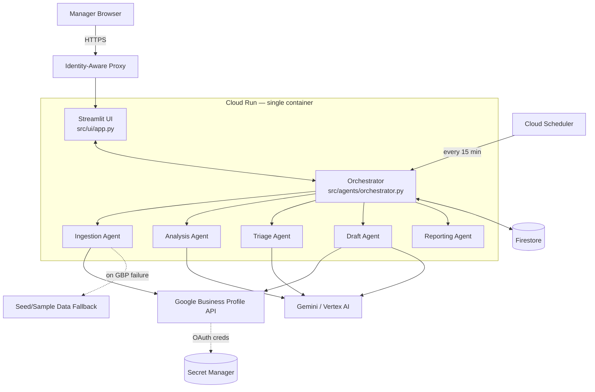
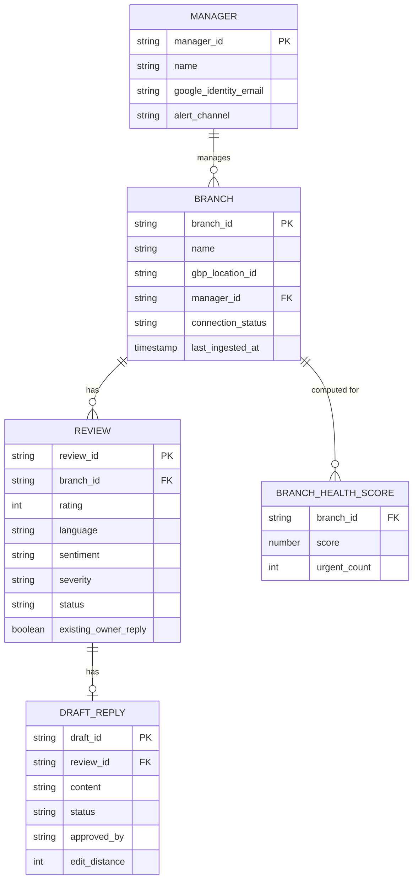
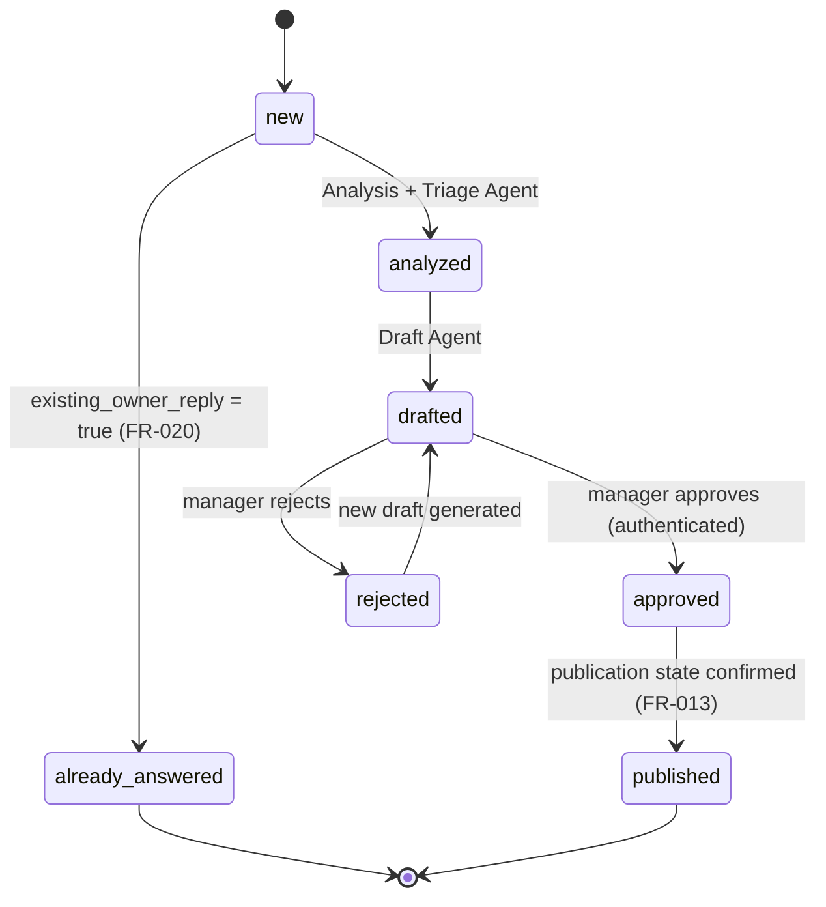
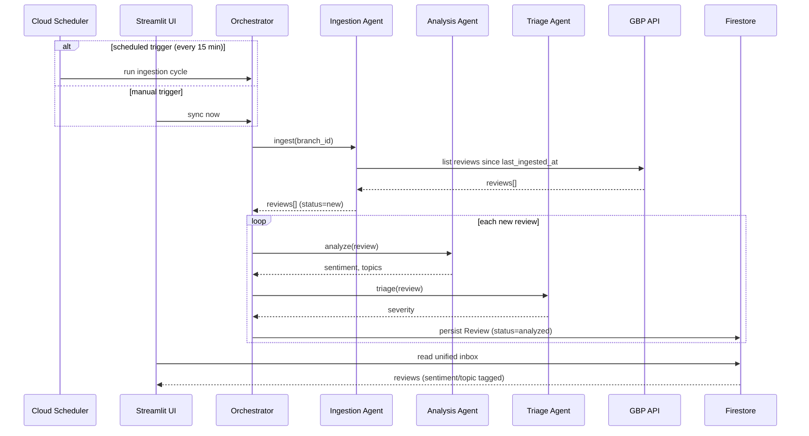
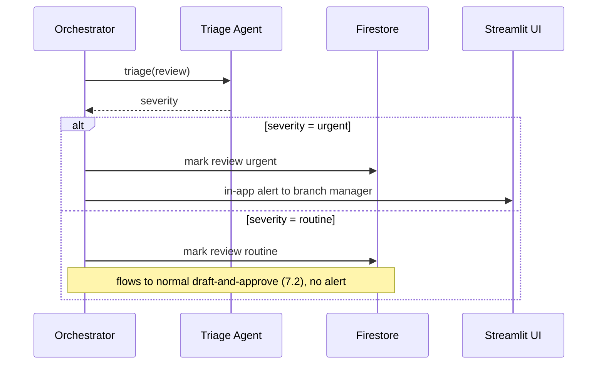
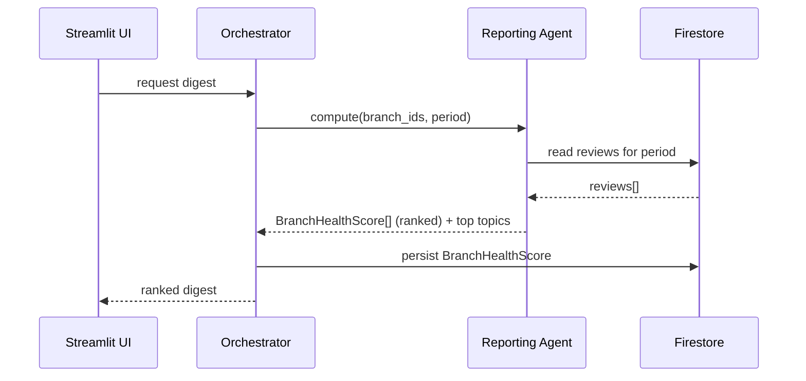
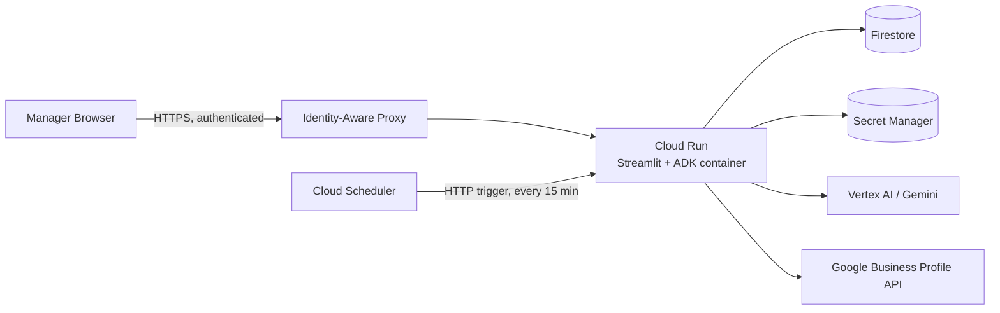

# Architecture & Flow: Reputation Sentinel Ops

Dev reference document, derived from the existing Spec Kit artifacts for this feature —
[`spec.md`](./spec.md), [`plan.md`](./plan.md), [`data-model.md`](./data-model.md),
[`contracts/`](./contracts/), [`tasks.md`](./tasks.md), and
[`.specify/memory/constitution.md`](../../.specify/memory/constitution.md). This document
doesn't introduce new decisions — it visualizes and cross-references what those artifacts
already specify, as a single reading surface for implementation.

## 1. Overview

Reputation Sentinel Ops is a multi-agent system (Ingestion, Analysis, Triage, Draft,
Reporting + Orchestrator) that monitors Google Business Profile reviews across a manager's
connected branches, tags them with sentiment/topic/severity, drafts personalized replies,
and requires explicit manager approval before anything publishes. See `spec.md` for the full
requirements (FR-001..FR-020) and `plan.md` for the Constitution Check / Complexity Tracking
behind the decisions summarized here.

## 2. Tech Stack

| Layer | Technology | Why |
|---|---|---|
| Language | Python 3.11+ | One runtime across agents, orchestration, and UI — no second language under a same-day timebox (plan.md Technical Context) |
| Agent orchestration | Google Agent Development Kit (ADK) | Multi-agent pipeline (5 agents + Orchestrator), GCP-native, maps to Principle II | 
| LLM | Gemini via Vertex AI (`google-genai` SDK) | Sentiment classification, topic tagging, severity scoring, draft generation (FR-003/004/006/009) |
| UI | Streamlit | Mandated by constitution Technology Constraints — Python-native, fast to build, deployable to Cloud Run (FR-018) |
| Storage | Firestore | Document-shaped, fast read-after-write for the approval flow (research.md — Storage) |
| Secrets | Secret Manager | Per-branch OAuth credential storage, never plaintext (Security & Data Handling) |
| External API | Google Business Profile API (`google-api-python-client` + `google-auth-oauthlib`) | Branch-connect OAuth, review read, reply write (FR-001/002/012) |
| Resilience | `tenacity` | Retry/backoff on every external call (Principle IV) |
| Scheduling | Cloud Scheduler | Automatic 15-minute ingestion cycle so SC-001's freshness target doesn't depend on a manual click (research.md — Ingestion Scheduling) |
| Access control | Identity-Aware Proxy (IAP) | Gates the whole UI to authorized manager identities (FR-019/SC-007, constitution v1.2.0) |
| Deployment | Cloud Run | Single container inside the team's GCP hackathon sandbox — the "aplikasi yang berjalan" submission requirement |
| Testing | `pytest` (contract/unit/integration) | Production-readiness discipline (Principle IV) |

## 3. System Architecture

**Structure decision** (plan.md): single project/container, not split frontend+backend —
Principle V (Timebox-Aware Simplicity). This is a documented trade-off against Principle II's
"independently deployable" wording; see plan.md Complexity Tracking.

## 4. Component Responsibilities

From `contracts/agent-interfaces.md` — each agent's contract, unchanged here:

| Component | Input | Output | Contract notes |
|---|---|---|---|
| **Ingestion Agent** | `{ branch_id }` | `{ reviews: Review[] }` (status `new`) | On GBP error: retries, then falls back to seed data; a sync error MUST be surfaced distinctly from "zero new reviews" |
| **Analysis Agent** | `{ review }` (status `new`) | `{ review_id, sentiment, topics }` | Runs for `id`/`en`; best-effort (not error) for other languages |
| **Triage Agent** | `{ review_id, sentiment, topics }` | `{ review_id, severity }` | Runs before Draft Agent; `urgent` triggers the manager alert path independent of draft state |
| **Draft Agent** | `{ review_id, sentiment, topics, severity }` | `{ review_id, draft_content }` | Never calls the publish endpoint itself; skipped entirely when `existing_owner_reply = true` (FR-020) |
| **Reporting Agent** | `{ branch_ids, period }` | `{ rankings: BranchHealthScore[] }` | Read-only — no ingestion/analysis side effects |
| **Orchestrator (publish step)** | `{ draft_id, approved_by, approved_content }` | `{ review_id, publication_state }` | Only invocable after a recorded, *authenticated* manager approval (FR-019); polls publication state before reporting `published` |

## 5. Data Model

Full field list and rationale: `data-model.md`.

## 6. Review Lifecycle

## 7. Key Flows

### 7.1 Ingestion → Inbox (User Story 1)

### 7.2 Draft → Approve → Publish (User Story 2)

```mermaid
sequenceDiagram
    participant UI as Streamlit UI (IAP-authenticated manager)
    participant ORCH as Orchestrator
    participant DRA as Draft Agent
    participant FS as Firestore
    participant GBP as GBP API

    ORCH->>FS: check review.existing_owner_reply
    alt existing_owner_reply = true
        ORCH->>FS: mark review already-answered (FR-020)
    else needs a draft
        ORCH->>DRA: draft(review)
        DRA-->>ORCH: draft_content
        ORCH->>FS: save DraftReply (status=pending)
    end
    UI->>FS: load draft
    FS-->>UI: draft_content
    UI->>UI: manager edits (optional)
    alt manager approves
        UI->>ORCH: approve(draft_id, approved_by = IAP identity)
        ORCH->>FS: record approver + edit_distance (FR-014 / SC-006)
        ORCH->>GBP: publish reply
        GBP-->>ORCH: publication_state
        ORCH->>FS: update Review/Draft status
        ORCH-->>UI: publish result (published/pending/rejected)
    else manager rejects
        UI->>ORCH: reject(draft_id)
        ORCH->>DRA: draft(review)
        DRA-->>ORCH: new draft_content
        ORCH->>FS: save new DraftReply (status=pending)
    end
```

### 7.3 Urgent Escalation (User Story 3)

### 7.4 Cross-Branch Digest (User Story 4)

## 8. Cross-Cutting Concerns

| Concern | Mechanism | Traces to |
|---|---|---|
| Approval gate | Publish reachable ONLY via Orchestrator's post-approval step; no agent holds standing publish permission | Principle I, FR-010, SC-004 |
| Access control | Identity-Aware Proxy in front of Cloud Run; identity resolved to `Manager.google_identity_email` | FR-019, SC-007, constitution v1.2.0 Security & Data Handling |
| Resilience | `tenacity` retry/backoff on every GBP/Gemini call; seed/sample dataset fallback on exhausted retries | Principle IV |
| Accountability | `approved_by` + timestamp recorded from the authenticated session, never free text | FR-014 |
| Data sensitivity | Review text/reviewer name logged only at debug level, redacted, not retained beyond debugging need | Security & Data Handling |
| Scope discipline | Geo Benchmark Layer, Slack/email alerts, full historical backfill are explicitly not implemented | Principle V, spec.md Assumptions |

## 9. Deployment View

## References

- Requirements: `spec.md` (FR-001..FR-020, SC-001..SC-007)
- Technical decisions + rationale: `plan.md`, `research.md`
- Task breakdown (implementation order): `tasks.md`
- Governing principles: `.specify/memory/constitution.md` (v1.2.0)
